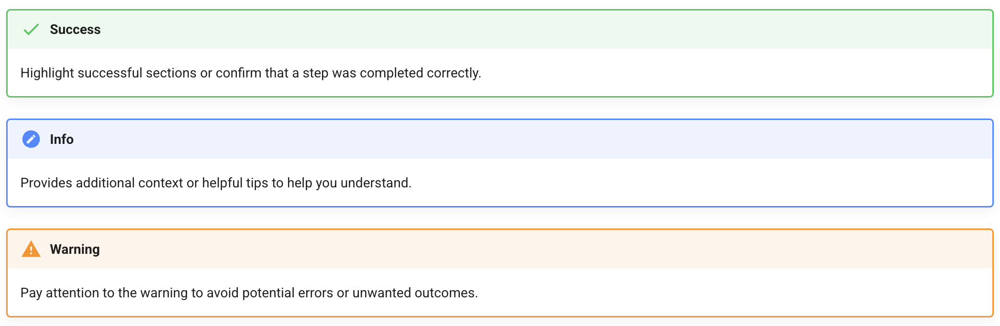

# Overview of Draw.io Documentation

Welcome! This guide provides a step-by-step overview of essential [Draw.io](https://www.drawio.com/) functions commonly used in CST courses.

The purpose of this guide is to help new CST students become familiar with the fundamental features of Draw.io, a widely used web-based diagramming tool in the CST program. Additionally, we’ll highlight some useful shortcuts to enhance your efficiency while creating diagrams.

Here are the topics of this document

* Create, share, and export a document in Draw.io
* Create a new diagram in Draw.io
* Format a diagram in Draw.io

## How We Planned and Collaborated

As soon as we received the user guide assignment, our team gathered to brainstorm key topics to include and divided the workload accordingly.

For communication, we primarily used Discord for online discussions, supplemented by in-person meetings to coordinate our efforts.

To manage our work efficiently, we utilized Git and GitHub for version control. Each team member was responsible for specific pages to prevent merge conflicts. Once all content was written, we used Discord to discuss updates and coordinate our commits.

## How We Developed This Guide

This guide is based on our firsthand experience with Draw.io after completing two terms in the CST program. We identified common challenges we encountered while using the tool and compiled useful tips we discovered throughout the year to make diagramming easier for future students.

### Using MkDocs

We used [Material for MkDocs](https://squidfunk.github.io/mkdocs-material/) as our MkDoc theme because we appreciated its built-in components. To align the guide with Draw.io’s theme, we customized the styles and overall appearance.

### Using Markdown

The entire guide was written in Markdown, with additional plugins used to customize fonts and styles.

### Using VS Code

Both team members used VS Code to create and edit the Markdown files. To preview our work, we served the guide using MkDocs through the terminal, allowing us to see the rendered output in real time.

## How We Enhanced Readability

To make the guide more user-friendly, we focused on visual presentation.

Since Draw.io involves interactive actions that can be difficult to explain with only text and static images, we incorporated GIFs to illustrate each step more clearly.

Additionally, we leveraged MkDocs' admonitions to highlight key information relevant to the instructions.

## Conclusion

Creating this guide gave us a deeper understanding of Draw.io and its features. We’re excited to share our insights and practical tips with you.

Thank you for reading! We hope this guide enhances your experience with Draw.io.

This document was built on: [Material for MkDocs](https://squidfunk.github.io/mkdocs-material/).