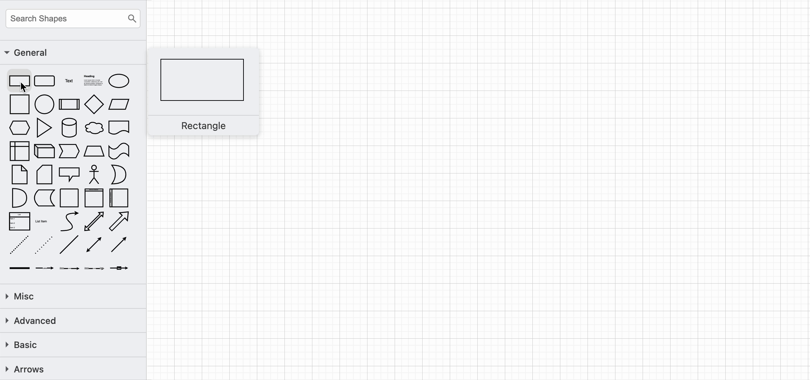
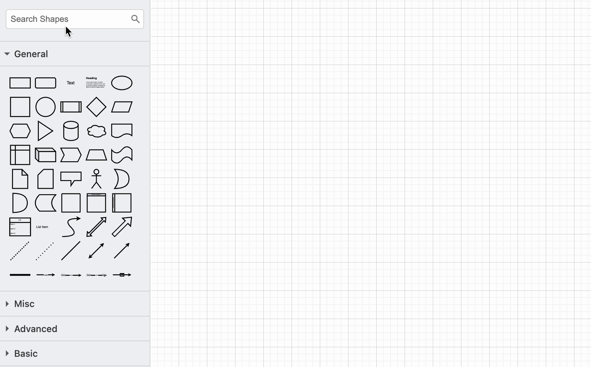
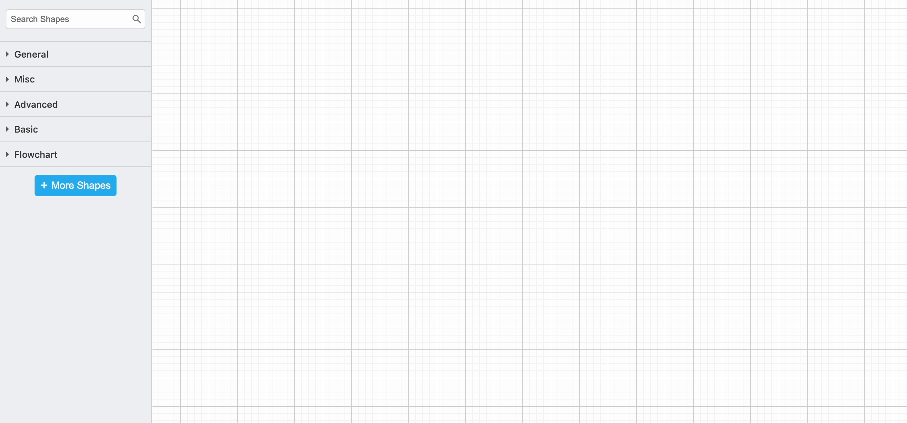
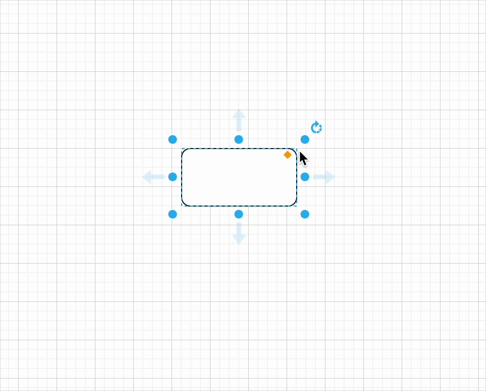
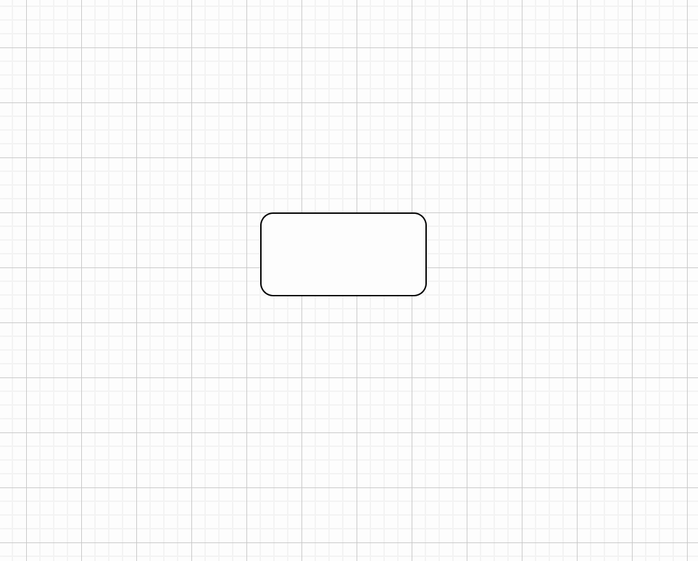
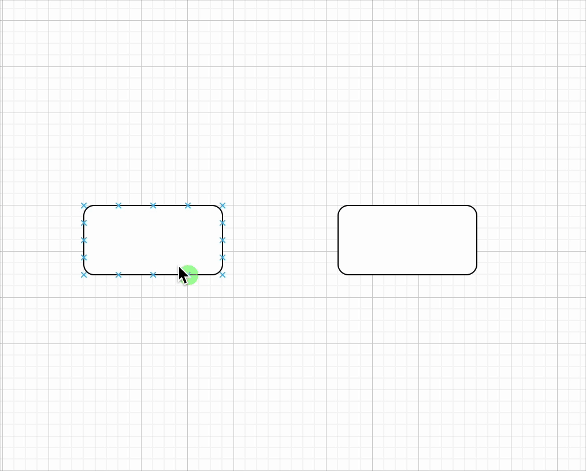
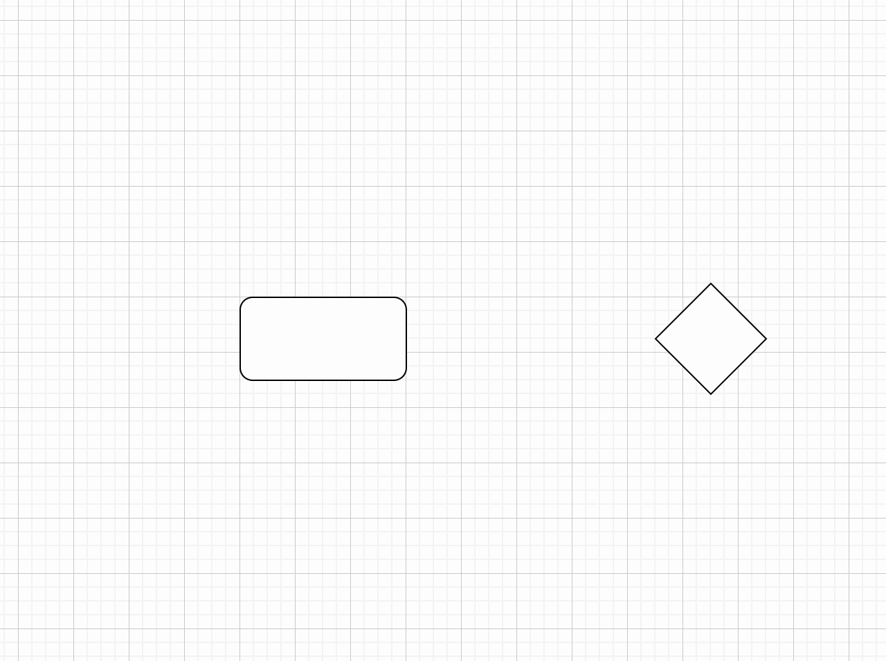
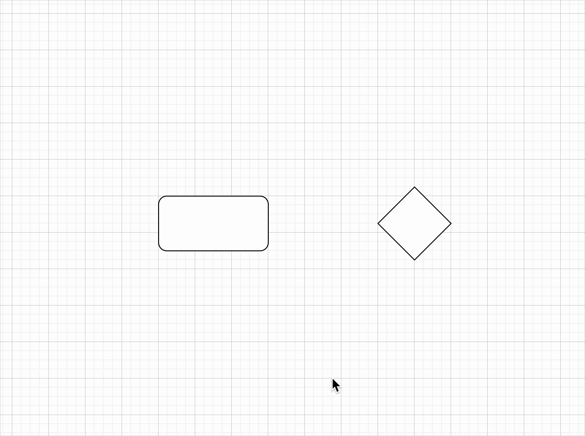
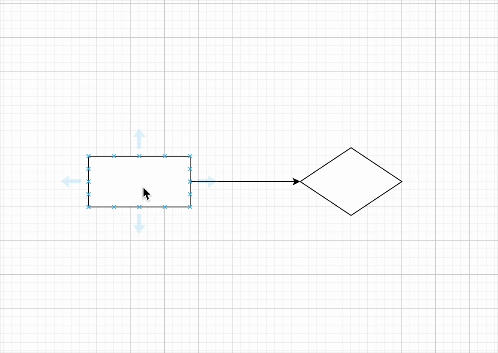
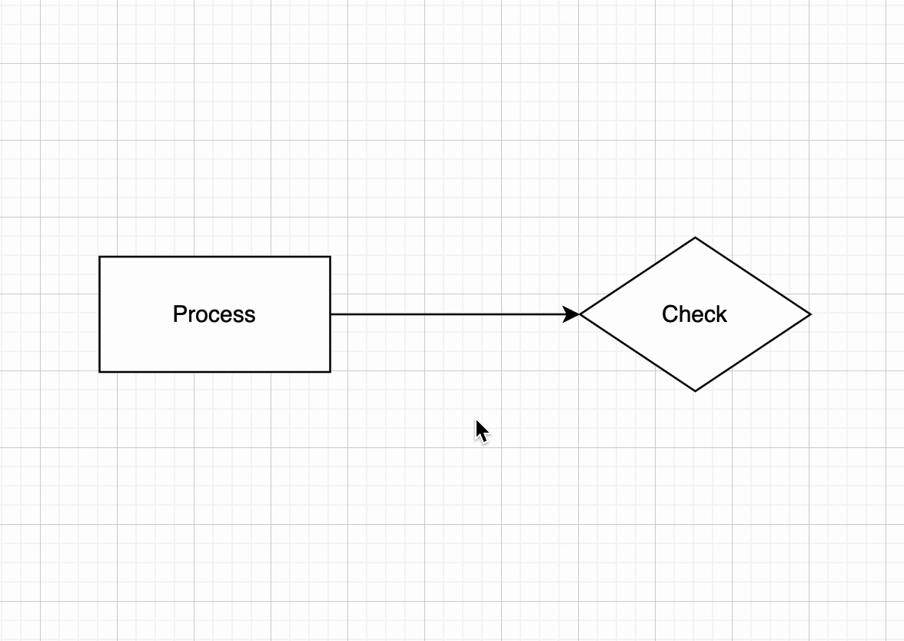

# Create a diagram

## Overview

In this section, you will learn how to create diagrams by adding, modifying, and connecting shapes. You will also explore how to label elements effectively to make diagrams more understandable. This guide provides step-by-step instructions to help you master these fundamental skills.

## Fundamental Steps to Create a Diagram

### Add a Shape

You can insert a shape into the drawing canvas using one of these methods:

- **Click** on a shape in the *General shape library* to place it on the canvas.

- **Drag** and drop a shape from the *General shape library* to your desired location.

- **Double-click** on an empty space in the canvas and select a shape from the menu.

### Search for a Shape

Easily locate a specific shape using the *Search Shapes* feature:

1. In the left sidebar, find the `Search Shapes` box at the top.

2. **Type** a keyword related to the shape you need (e.g., `flowchart` or `UML`).

3. **Click** on the desired shape from the search results or drag it onto the canvas.

### Add a Shape Library

In addition to the shapes in the General and Advanced shape libraries, you can use shapes from the Flowchart shape library.

1. Click on **More Shapes** at the bottom of the left sidebar.

2. A pop-up window will appear, displaying various shape categories. Check the boxes next to the desired shape library to enable it.

3. Click **Apply** to include the selected libraries in your canvas.

!!! warning "Warning: Excessive library list"

    Enabling additional shape libraries gives you more options, but too many libraries can make it harder to find the shapes you need.
    
### Move, Resize, Rotate, and Delete Shapes

**Move**: Click and drag a shape to reposition it.

**Resize**: Select a shape and drag its round grab handles to adjust its size. Hold `Control` (Windows/Linux) or `Command` (Mac) to keep it centred. Hold `Shift` to maintain the shape's proportions.

!!! warning "Warning: Distorted shapes"

    If you resize without holding `Shift`, your shape may become distorted.

**Rotate**:  Click the shape and drag the *rotate handle* (round arrow) at the top right to spin it around its center.

**Delete**: Select a shape and press `Backspace` or `Delete`, or use the **Delete tool* in the toolbar.

### Connect the Shapes

#### Draw a Floating Connector

Floating connectors automatically adjust their position as shapes move or their connecting paths change.

1. **Hover** over the source shape until directional arrows appear.

2. **Move your cursor** over the arrow in the direction you want to create a connection.

3. **Drag** the connector from the source shape to the target shape.

4. **Release** when the target shape’s outline turns blue.

#### Draw a Fixed Connector

Fixed connectors stay attached to a specific point on a shape, regardless of movement.

1. **Hover** over the source shape to reveal connection points (small crosses along the perimeter).

2. **Drag** a connector from a connection point on the source shape.

3. **Hover** over the target shape until its connection points appear.

4. **Position** the cursor over a connection point until it highlights green, then release to attach the connector.

### Add Labels

#### Add a Shape Label

Shape labels on shapes make it easier to understand a diagram quickly.

1. **Click** on a shape and type the text to add a new or replace a label.
2. **Press** `Enter` (Linux/Windows) or `Control + Enter` (Mac) to save the label.

!!! tip "Tip: Line break inside a label"

    Press `Shift + Enter` to add a line break in a label.

#### Add a Connector Label

You can add more than one label to a connector - at the source end, the target end, and in the middle.

1. **Double-click* at the desired location on the connector to add a label.
2. To reposition the label, **click** on it and drag the `small yellow diamond` to a new position.

!!! tip "Tip: More precise positioning"

    If your label isn't perfectly positioned, zoom in and use the arrow keys for fine adjustments.

## Conclusion

By the end of this section, you will have successfully learned the following:

:white_check_mark:&nbsp; How to add, move, resize, and delete shapes on the drawing canvas.

:white_check_mark:&nbsp; How to connect shapes using floating and fixed connectors.

:white_check_mark:&nbsp; How to add labels for both shapes and connectors.

Great job! &nbsp;:blush:&nbsp; You can go ahead and click on the link below to move on to the next step:

[Format Diagrams](format-diagrams.md)