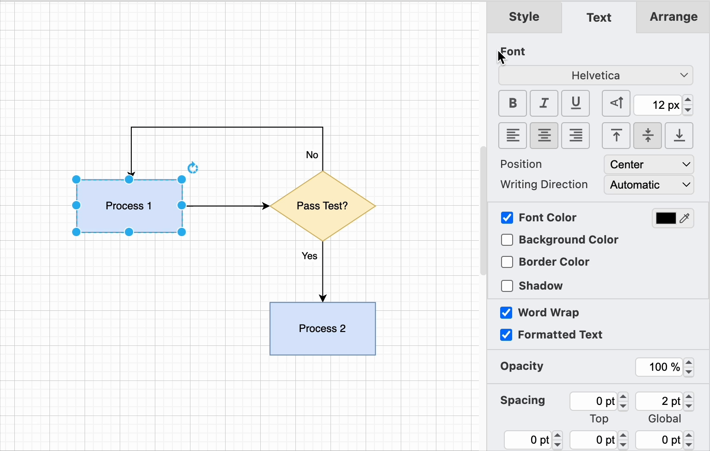

# Format Diagrams

## Overview

This section will cover how to enhance diagrams by formatting shapes, connectors, and labels. Proper formatting improves clarity and ensures a professional appearance. You'll learn how to group, style, and modify elements effectively.

## Steps for Formatting a Diagram

### Group the Shapes

!!! note "Grouping shapes fosters formatting consistency"

    Grouping shapes allows you to move, resize, and format multiple elements as a single unit.

To group shapes:

1. **Select multiple shapes** using one of the following methods:

    - Click and drag to create a selection box around the desired shapes.

    - Hold `Shift` and click each shape individually.

2. **Group the selected shapes** using one of these methods:

    - Right-click and choose **Group** from the context menu.

    - Press `Ctrl + G` (Windows/Linux) or `Cmd + G` (Mac).

3. **Ungroup shapes** if necessary:

    - Right-click on a grouped shape and choose **Ungroup**.

### Style a Shape

Once you've added shapes, connectors, and labels, you can apply styles to improve visual appeal.

1. **Select a shape** or multiple elements by holding `Shift` and clicking.

2. **Apply styles** using the Style tab:

    - The **style palette** at the top allows you to adjust both fill and outline colors.

    - Click the left or right arrows to view additional styles.

    - To set a custom color, click the **color button** next to *Fill* or *Line*, then choose a color or enter a hex code.

!!! tip "Consistency is Key"

    Stick to a color scheme or style template to avoid confusion. Too many different colors can overwhelm the viewer and reduce the diagram's effectiveness.

### Style a label

Modify text styles for labels via the *Text* tab:

- Select a different **font** from the list.
- Apply **bold**, *italic*, or **underline** formatting.
- Adjust text alignment (**left, center, or right**).
- Click the **color button** next to *Font Color* to modify text color.

!!! tip "Label clarity"

    ensure that the font size is legible and that there’s enough padding between the text and surrounding shapes. Keep text concise to avoid clutter.

### Style a connector

You can customize connectors in the *Style* tab:

- The **style palette** modifies both fill and outline colors.
- Adjust arrow styles to have **arrows at both ends or none**.
- To change a connector's path, **drag a waypoint** to a new position.

!!! warning "Avoid overlapping connectors"

    Ensure that they do not overlap with shapes or other connectors, as this can reduce clarity. Use curved connectors or change paths when necessary.

## Conclusion

By the end of this section, you will have successfully learned the following:

:white_check_mark:  How to group and ungroup shapes for easier manipulation.

:white_check_mark:  How to style shapes, labels, and connectors to enhance diagram readability.

:white_check_mark:  How to adjust connector paths and arrow styles for better visual clarity.

Awesome!  :tada:  Check out the next page if you've had any issues getting the project to work:

[Troubleshooting](troubleshooting.md)