# General Operations

## Overview

In this section, we will guide you through some basic setting up operations, including creating a draw.io file, sharing it with others, and exporting it locally.

## Create a Draw.io file
Here we are going to create our first file on draw.io. Make sure you are signed in to your Google account.

1. When you first open draw.io, you’ll see a screen like below. 
**click** the icon of `Google Drive`.

    <figure markdown>
    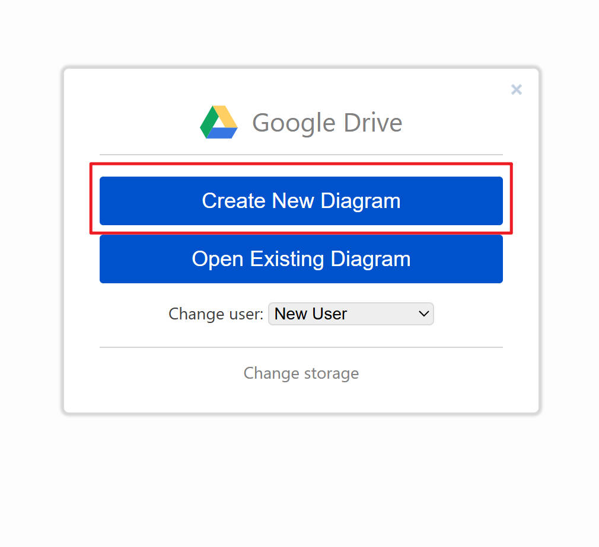{width="500"}
    </figure>

2. **Select** `Blank Diagram`, and **click** `Create`.
   <figure markdown>
   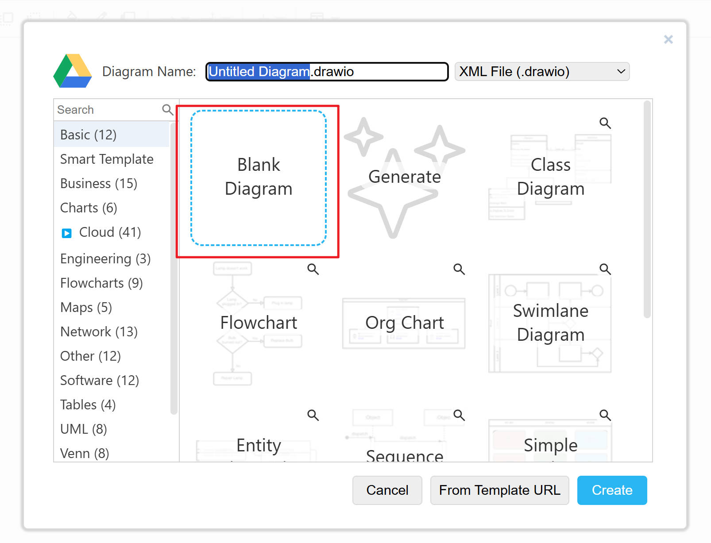{width="500"}
   </figure>
3. **Change** the `file name` in the next pop-up window. Keep the other settings as default.
      <figure markdown>
   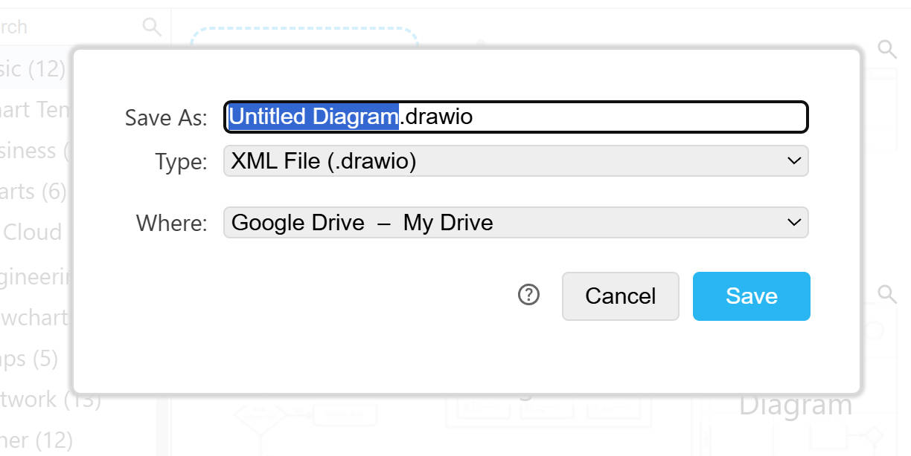{width="500"}
      </figure>
4. **Click** `Save` and wait a few seconds while draw.io loads the editing tools.

!!! note "Info"

    Following is an overview of the draw.io layout, provided for your reference. Memorization is not necessary at any point.
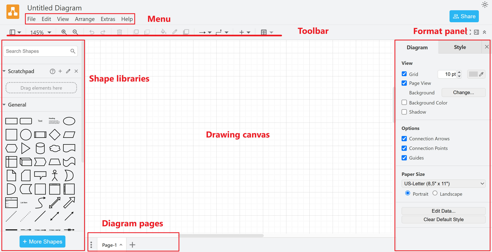

!!! note "Auto Save"
    
    After creating a file in Google Drive, draw.io will automatically save your changes. You do not need to worry about losing your progress.

## Share a file
Draw.io provides a collaboration feature that allows you to work on diagrams with others. This section will introduce 2 ways to invite co-workers: by sending invitation via email or sharing the link.

### Via email ###

1. **Click** the blue `Share` on the top right of the page.

2. **Enter** the email address that you want to share your document with in the input box, return.

   <figure markdown>
   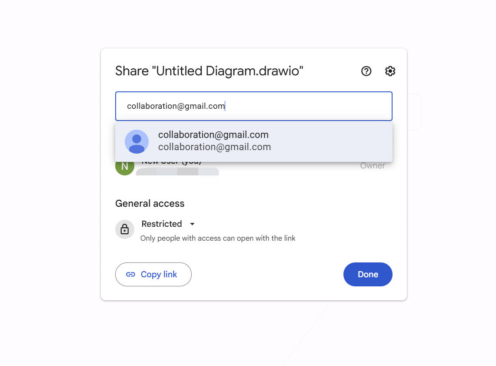{width="600"}
   </figure>

3. **Select** the correct access on the dropdown menu, then **click** `Send`.

   <figure markdown>
   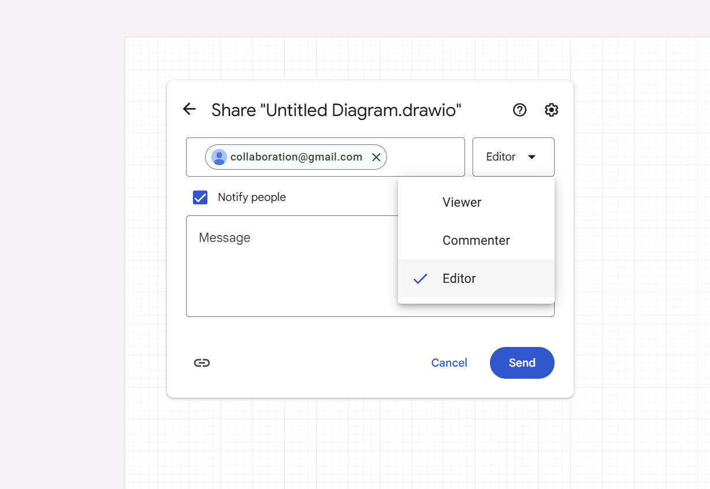{width="500"}
   </figure>

!!! note "What is the Role"
    
         there are three levels of permissions: 
         Editor: Can edit all content in the diagram.
         Commenter: Can view and leave comments but cannot make changes.
         Viewer: Can only view the diagram and cannot share, edit, or change access permissions.

### Via link ###

1. **Click** the blue `Share` on the top right of the page.

2. In `General access` section, **click** `restricted` dropdown menu, and **select** `Everyone with the link`.

   <figure markdown>
   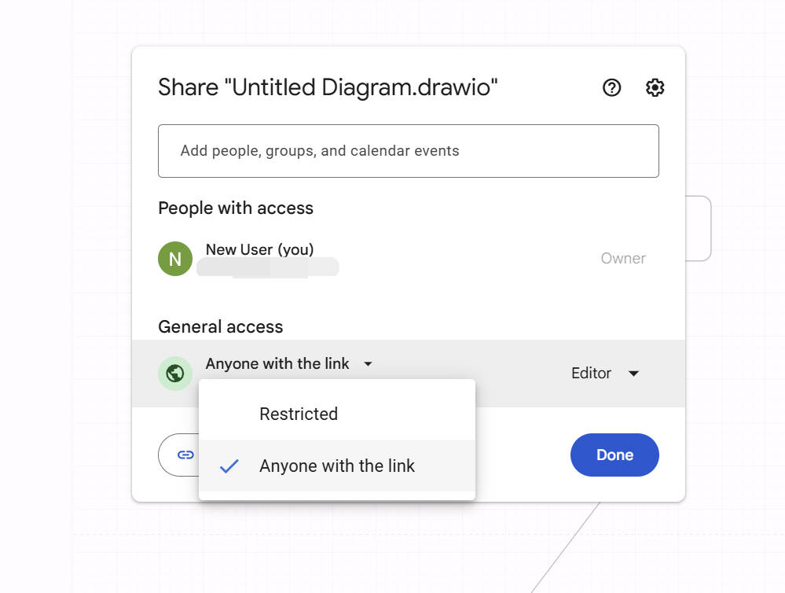{width="500"}
   </figure>
   
3. **Click** the `Viewer`dropdown menu on the right side, **select** the access you want to give them.

   <figure markdown>
   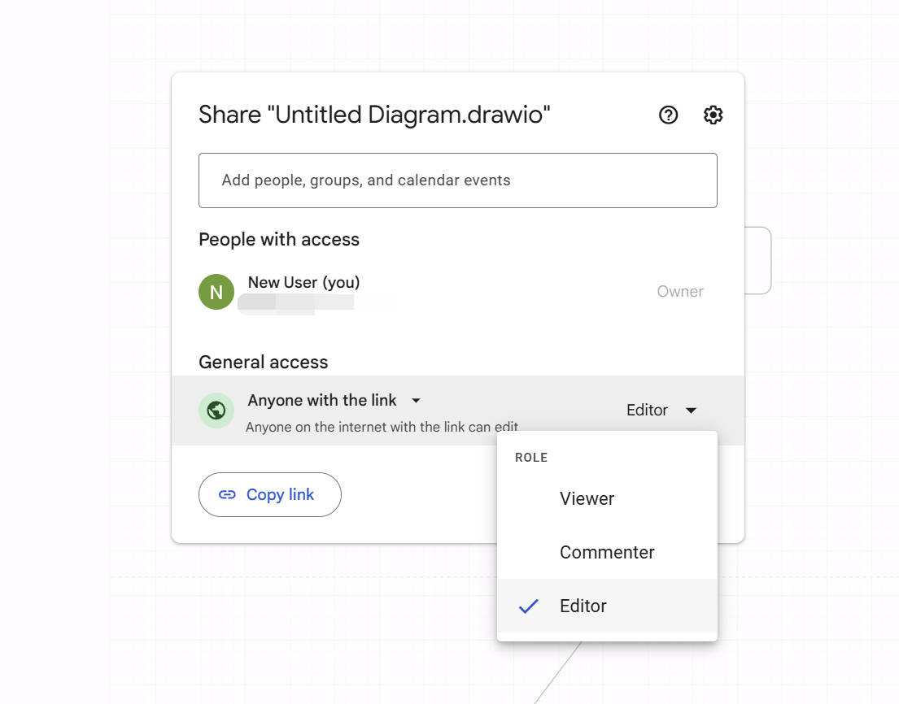{width="600"}
   </figure>

4.**Click** the left bottom `Copy link`, and **send** the link by pasting it to your collaborators through any chat app.

!!! Success "Success"

    You successfully shared your file. Just give them a quick reminder to check the invitation!

## Export a file

In this section, we will introduce how to export your diagram as a PDF or image file. We will also show you how to export your diagram in a revisable XML format, which allows for integration with other diagramming tools.

### Export as a PDF or image ###

1. **Click** the `File` in menu, then **select** `Export as`. Here we can find a menu of all common format.

      <figure markdown>
      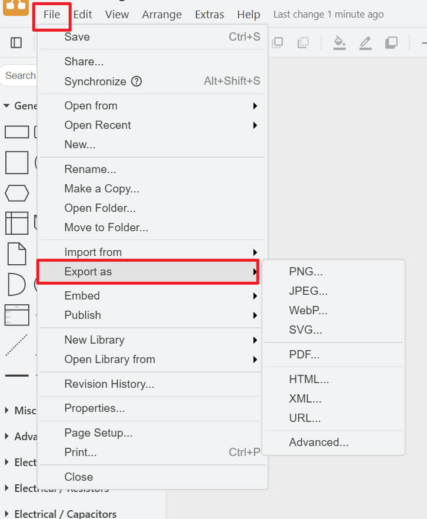{width="600"}
      </figure>
   
2. **Select** PDF. This is the most commonly used format and supports variety custimzation options.

      <figure markdown>
      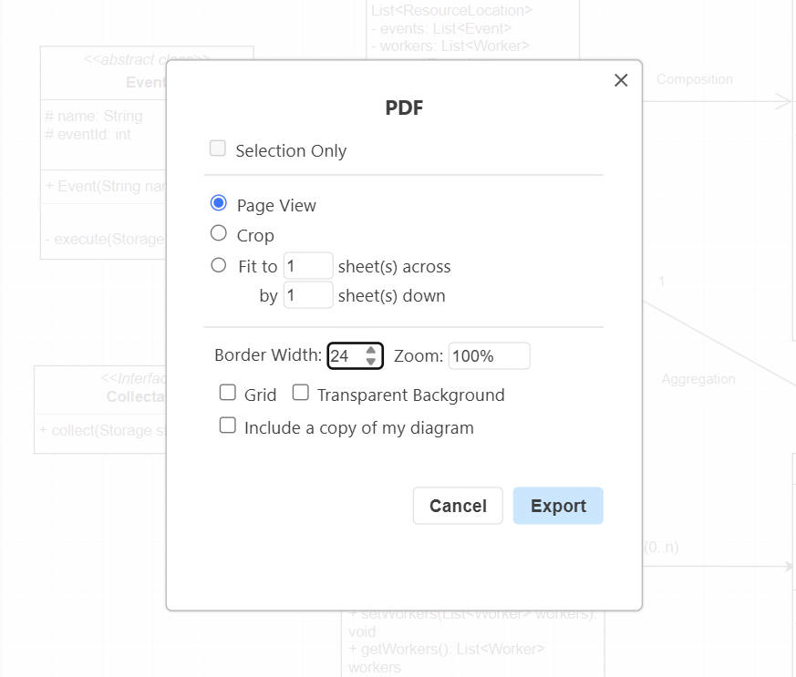{width="600"}
      </figure>
   
      a. `Selection Only` Exports only the part of the diagram that you manually selected.

      b. `Page View` Divides the diagram canvas into uniformly sized pages.

      c. `Crop`  Exports the entire diagram on a single canvas without cutting.

      d. `Fit to ... sheets`  Automatically resizes your diagram to fit within the specified number of sheets in both width and height.

      <figure markdown>
      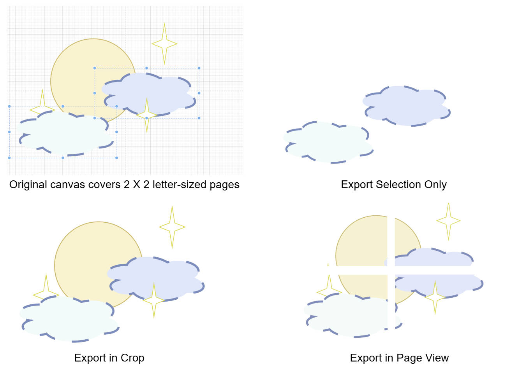
      </figure>
   
      e. `Border Width` Extend the page to increase or shrink the border of canvas. 

   f. `Zoom` Zoom the printing diagram on canvas.

   g. `Grid` Export the diagram with grids in canvas.

   h. `Transparent Background` Export the diagram with transparent background.

   i. `Include a copy of my diagram` Embed the original diagram data into the exported PDF file. This will allow you to reopen and edit the diagram directly in draw.io.

3.**Select** `Export`. In the pop-up windows, change the name of the file if needed. 
      <figure markdown>
      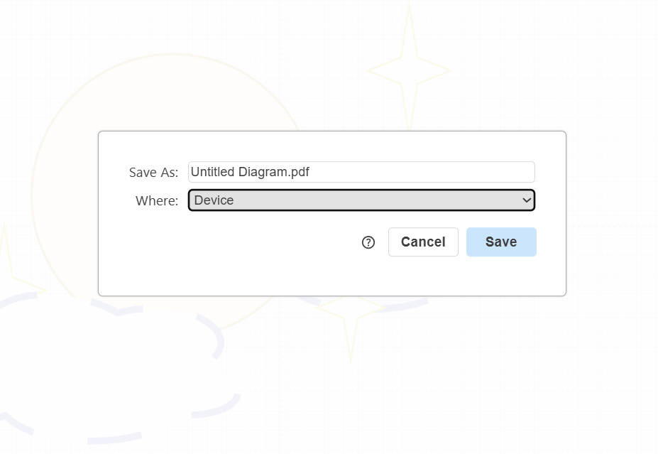{width="600"}
      </figure>

!!! warning "Keep the .pdf extend name"

      Do not remove the `.pdf` extension when renaming the file, as this may cause the file to open incorrectly

4.**Click** `Save`. The file will be downloaded automatically. 

!!! Success "Success"

      You have successfully exported your file to your local device.

## Conclusion

By the end of this section, you will have successfully learned the following:

:white_check_mark:&nbsp; How to create a new draw.io file and save it to Google Drive.

:white_check_mark:&nbsp; How to share your diagram with collaborators via email or link

:white_check_mark:&nbsp; How to export your diagram as a PDF.

Great job! &nbsp;:blush:&nbsp; Y Check out the next page and we are going to create the diagram!

[Create Diagrams](create-diagrams.md)