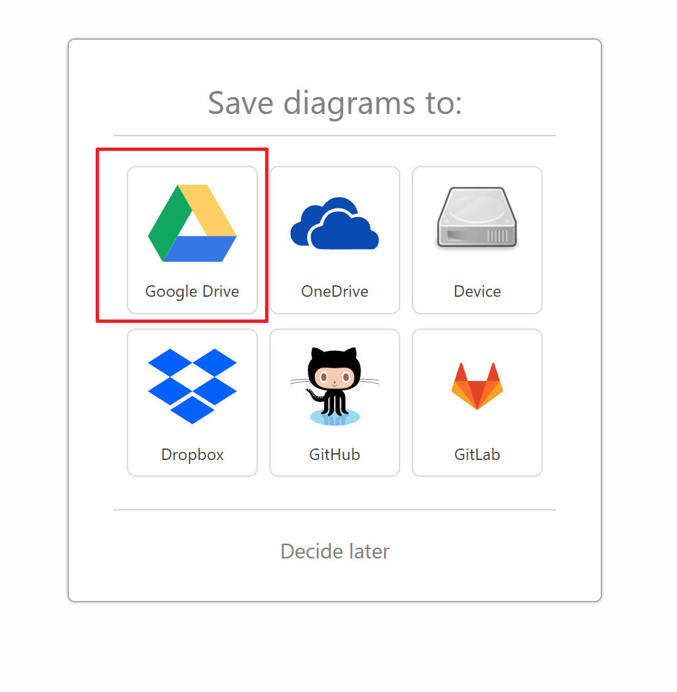
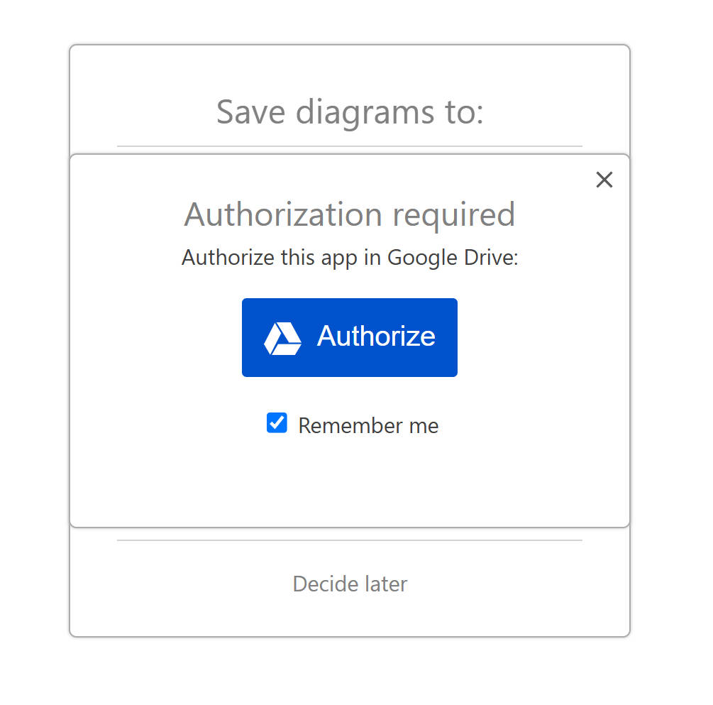
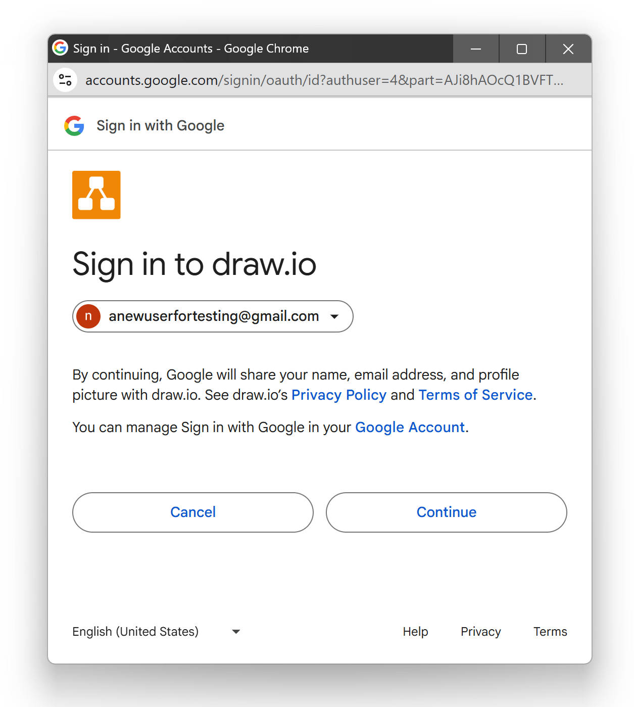
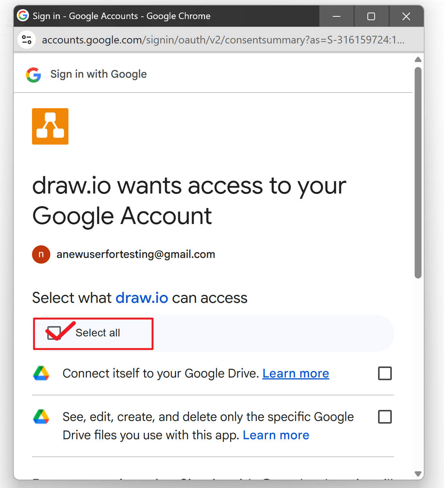

# General Operations

## Overview

In this section, we will guide you through some basic setting up operations, including creating a draw.io file, sharing it with others, and exporting it locally.

## Setup

First, let's set up your account and complete the authorization process.

1. When you first open draw.io, you’ll see a window like below. **Click** the `Google Drive` Icon.

      <figure markdown>
      {width="500"}
      </figure>

2. Keep `Remember me` selected, **Click** `Authorize` button.

      <figure markdown>
      {width="500"}
      </figure>

3. **Click** `Continue` and sign in your Google Account in new pop-up window.

      <figure markdown>
      {width="600"}
      </figure>

4. After finishing sign-in process, **Click** `Select all` to give draw.io full access. **Scroll** down to the bottom of the window, and **click** continue.
      
      <figure markdown>
      {width="500"}
      <figure markdown>

After a few seconds, the setup process will be complete!

## Create a Draw.io file
Here we are continue going to create our first file.

1. **Click** the button `Create New Diagram`.

     <figure markdown>
     {width="500"}
     </figure>

2. **Select** `Blank Diagram`, and **click** `Create`.

      <figure markdown>
      {width="600"}
      </figure>

3. **Change** the `file name` in the next pop-up window. Keep the other settings as default.

      <figure markdown>
      {width="500"}
      </figure>
   
4. **Click** `Save` and wait a few seconds while draw.io loads the editing tools.

!!! note "Info"

    Following is an overview of the draw.io layout, provided for your reference. Memorization is not necessary at any point.

!!! note "Auto Save"
    
    After creating a file in Google Drive, draw.io will automatically save your changes. You do not need to worry about losing your progress.

## Share a file
Draw.io provides a collaboration feature that allows you to work on diagrams with others. This section will introduce 2 ways to invite co-workers: by sending invitation via email or sharing the link.

!!! Note "This section is designed for Chrome browser"

      If you are using Firefox or Microsoft Edge, the steps may be different. Please refer to Google Drive documentation for instructions.

### Via email ###

1. **Click** the blue `Share` on the top right of the page.

2. **Enter** the email address that you want to share your document with in the input box, return.

      <figure markdown>
      {width="700"}
      </figure>

3. **Select** the correct access on the dropdown menu, then **click** `Send`.

      <figure markdown>
      {width="600"}
      </figure>

!!! note "What is the Role"
    
         Editor: Can edit all content in the diagram. Commenter: Can leave comments but cannot make changes. Viewer: Can only view the diagram and cannot share, edit, or change access permissions.

### Via link ###

1. **Click** the blue `Share` on the top right of the page.

2. In `General access` section, **click** `restricted` dropdown menu, and **select** `Everyone with the link`.

      <figure markdown>
      {width="700"}
      </figure>
   
3. **Click** the `Viewer`dropdown menu on the right side, **select** the access you want to give them.

      <figure markdown>
      {width="600"}
      </figure>

4. **Click** the left bottom `Copy link`, and **send** the link by pasting it to your collaborators through any chat app.

!!! Success "Success"

    You successfully shared your file. Just give them a quick reminder to check the invitation!

## Export a file as a PDF

In this section, we will introduce how to export your diagram as a revisable PDF.

1. **Click** `File` -> `Export as` -> `PDF`.

      <figure markdown>
      {width="600"}
      </figure>
   
2. In the new pop-up window, you can keep selections default. 

      <figure markdown>
      {width="600"}
      </figure>

      Below are introductions to the available customization options:

      a. `Selection Only` Exports only the part of the diagram that you manually selected.

      b. `Page View` Divides the diagram canvas into uniformly sized pages.

      c. `Crop`  Exports the entire diagram on a single canvas without cutting.

      d. `Fit to ... sheets`  Automatically resizes your diagram to fit within the specified number of sheets in both width and height.

      <figure markdown>
      
      </figure>
   
      e. `Border Width` Extend the page to increase or shrink the border of the canvas. 

      f. `Zoom` Zoom the printing diagram on the canvas.

      g. `Grid` Export the diagram with grids on the canvas.

      h. `Transparent Background` Export the diagram with transparent background.

      i. `Include a copy of my diagram` Embed the original diagram data into the exported PDF file. This will allow you to reopen and edit the diagram directly in draw.io.

3.**Select** `Export`. In the pop-up windows, change the name of the file if needed. 

      <figure markdown>
      {width="600"}
      </figure>

!!! warning "Keep the .pdf extend name"

      Do not remove the `.pdf` extension when renaming the file, as this may cause the file to open incorrectly

4.**Click** `Save`. The file will be downloaded automatically. 

!!! Success "Success"

      You have successfully exported your file to your local device.

## Conclusion

By the end of this section, you will have successfully learned the following:

- [x] How to create a new draw.io file and save it to Google Drive.

- [x] How to share your diagram with collaborators via email or link

- [x] How to export your diagram as a PDF.

Great job! &nbsp;:blush:&nbsp; Check out the next page where we are going to assist you in creating your first diagram!

[Create Diagrams](create-diagrams.md)